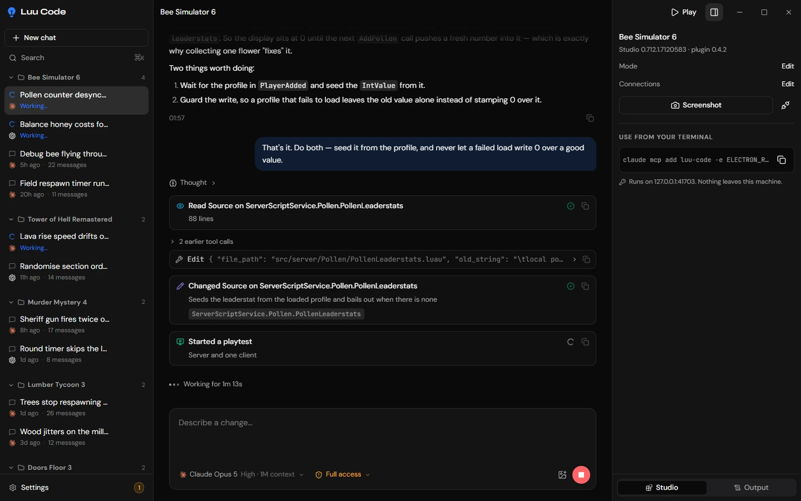

  

[Download](https://github.com/luumenlabs/code/releases/latest) · [Nightly builds](https://github.com/luumenlabs/code/releases) · [Contributing](CONTRIBUTING.md)

---

Luu Code hands your coding agent the keys to your open place. It reads the DataModel, edits scripts, presses Play, watches the output, clicks around the running game, takes screenshots, and fixes what it broke — while you watch.

You bring Claude Code, Codex, or a model on your own machine through Ollama. Luu Code brings Studio. No credits, no API key, no AI of its own.

## What the agent can do

| | |
|---|---|
| **Look around** | Services, instance trees, properties, attributes, tags, your selection, script source, what a class actually has |
| **Change things** | Create, delete, rename, reparent, clone, set properties, edit scripts, replace a pattern across every script at once |
| **Playtest** | Start and stop Play and Run mode, restart, wait for the game to be ready, give the link real latency |
| **Read output** | Everything Studio prints, including the error your last change caused and the ones from before it connected |
| **Work out why** | Log any line without touching the script, and profile which functions the frame time went into |
| **Poke the game** | Players, characters, PlayerGui, the camera, and Luau it runs live |
| **See the screen** | Screenshots of Studio, handed straight to the agent |
| **Play the game** | Keyboard, mouse, and clicks on real on-screen buttons |
| **Bring things in** | Search the Creator Store and drop models, meshes, images, audio, and animations into the place |

## Install

1. **[Download Luu Code](https://github.com/luumenlabs/code/releases/latest)** and run the installer — Windows.
2. Open **Settings → Updates**, press **Install** next to the Studio plugin, and restart Studio. The app carries the matching plugin, so there is no `.rbxm` to hunt down.
3. Have **Claude Code** or **Codex** installed and signed in. Luu Code drives whichever you have.

Running models locally? Pull one that supports tool calling in **Ollama** and it appears in the model picker beside the rest. Ollama models are run by the Codex CLI, so keep that installed too.

Prefer to install the plugin yourself? `LuuCode.rbxm` is attached to every release; drop it in Studio's **Plugins** tab → **Plugins Folder**.

### Updates

The app, the Studio plugin, and the MCP command ship from one release, so they cannot end up on different versions. A new build shows up in the sidebar.

### Nightly builds

Nightlies are published on the [releases page](https://github.com/luumenlabs/code/releases) alongside the stable builds. They wear a purple icon, install beside the release build, and carry their own plugin as `LuuCodeNightly.rbxm` — run both, neither overwrites the other. A nightly only ever updates to another nightly.

## Start

1. Open your place in Roblox Studio.
2. Open Luu Code.
3. Approve the six-digit code, once it matches the one Studio is showing.
4. Pick a model, and say what you want changed.

Try:

> The shop errors when I click Buy. Play it, find out why, and fix it.

> Make the lobby spawn brighter, then show me a screenshot.

Chats are saved per place. Open a place and its history is there.

## What it is allowed to do

The chip beside the send button holds seven switches — looking, editing, playtesting, running Luau, sending input, screenshots, the Creator Store. Flip one mid-conversation and the agent is told it no longer has it.

Studio only connects after you approve a pairing code, so knowing the port is not enough to reach your place. Everything runs on `127.0.0.1` and nothing is sent anywhere.

Luu Code works through Studio. It does not read or write your files.

## Prefer your own terminal?

The same Roblox tools are available over MCP, so you can skip the app. The server ships inside Luu Code — nothing to install, no npm package to keep in sync. **Settings → Connection** has the exact command for your install, ready to paste into Claude Code or `~/.codex/config.toml`.

It joins a running Luu Code server, or starts one. Only Studio has to be open.

## Contributing

Building Luu Code from source, adding Roblox operations, and supporting another coding agent are all covered in [CONTRIBUTING.md](CONTRIBUTING.md).

## License

MIT. See [LICENSE](LICENSE).
